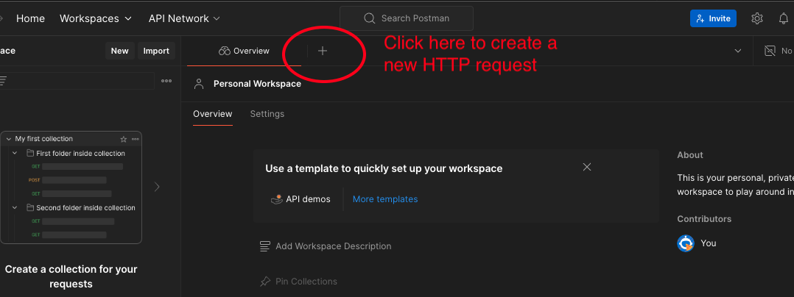
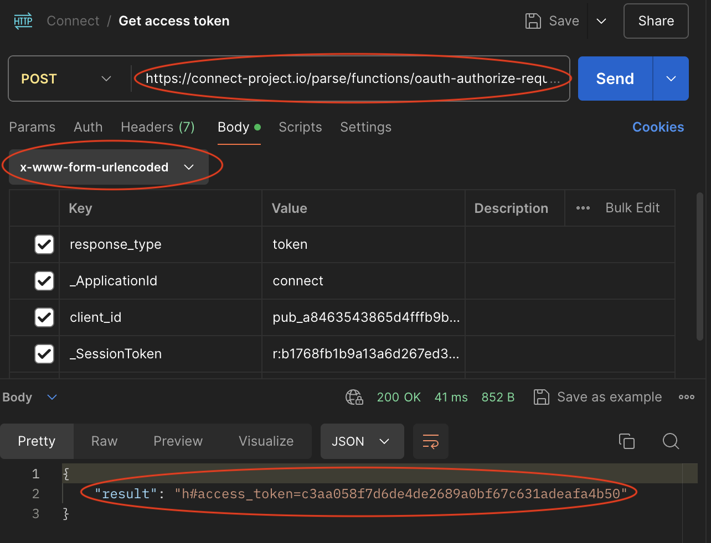

# Table of Content
- [Introduction to API Request & Postman](#introduction-to-api-request--postman)
- [Postman: GET data](#postman-get-data)
- [Postman: POST data](#postman-post-data)

# Introduction to API Request & Postman
This document explains how to post and get data to and from Connect API using Postman.

Postman is a software for testing HTTP APIs. If you know nothing about API and HTTP requests, this is a great starting point. First, please go to their [homepage](https://www.postman.com/) to download and install the software. Once you open Postman on your computer, you will be able to find some resources on API requests on its home page.

API is the acronym for application programming interface. To transmit data on the web requires the use of API, which handles the communication bteween your local computer and the remote server. HTTP (Hypertext Transfer Protocol) is the protocol standardising information transfer on the web. HTTP procotol also defines standard methods for data transmission, including: 
1. GET (retrieve data from server)
2. POST (send data to server)
3. PUT (send data to replace an entire resource in server)
4. PATCH (send data to make partial changes to existing resource in server)
5. DELETE (delete data in the server)

In this README, we will only focus on GET and POST methods. This might sounds very abstract. Let's send a HTTP request to Connect API to retrieve some data, and you might know it better.

# Postman: GET data
Once you open Postman, go into the Workspace, then create a new HTTP requst by clicking the topright '+' sign as shown below.

 
 

On the new request tab, I want to highlight four things, as circled in the image below:

1. Request method: you can choose different API request method on the top left, e.g., GET, POST and DELETE.
2. URL: this is the url where you will send request to and retrieve data from
3. Params: section to specify the query parameters
4. Headers: section to specify context

 
 

Now, let's create a first GET request to retrieve GameScore data from Connect. We first select the GET method, because we're retrieving data. For the url, type in this link: `https://connect-project.io/parse/classes/GameScore`. If you want to retrieve other data, please swap the end of url to other data class, e.g., to retrieve `userAnnotations`, the url will be `https://connect-project.io/parse/classes/userAnnotations`. If you want to know how URL works and is constructed, check out this section: [Note on URL](#note-on-url). 

 
 

Next, let's configure the headers. Header is an optional section of an HTTP request, that provides additional information to the server. They can include details about the client (i.e., the browser), the request itself, and the data being sent or requested. Another important section of an HTTP request is the body, where we put in our data. We will explore it in the POST data section. 

Below is how we configure the header. The first five key-value paris (i.e., Host, User-Agent, Accept, Accept-Encoding, Connection) are default settings. They are generated by Postman, no need to change any of them.

We need to add `x-parse-application-id` and `x-parse-session-token` manually. The value of `x-parse-application-id` is always `connect`. But the value of session token always changes. Session token is basically a token that tells the remote server who you are, so that it knows you are a trustworthy person and can send data to you. Anyone will a connect account has a session token. 

 
 

To retrieve your own session token, go to the [connect platform](https://connect-project.io/), sign in or register a new account. Once log in, click the drop-down menu on top-right, and go to the 'My Profile' section. Within the 'My Profile' section, you can see your session token, copy it and paste into the HTTP request. Please note that your session token will be regenerated after a while to guarantee security, if your request does not work, double check if your session token is expired. 

Please note, by default, Postman also has `Cache-Control` and `Postman-Token` ticked in the header section. They can generate errors in the server, so we will need to disable them. Click 'Go to settings' on the right to lauch Global Setting menu, then within the 'General' tap, scroll down to the 'Headers' section, uncheck the 'Send no-cache header' and 'Send Postman Token header'. 

 
 

Once you configure the HTTP method, URL, and headers correctly, you can send the GET request and retrieve the GameScore data. On Postman, you can see that the remote server send back a HTTP response with body, cookies, headers, status code, and so on.

If your HTTP request has any issues, the status code will be different. 200 OK status is the default status code for saying that the resqust has gone through properly, and any code staring with 4 is indicating bad requests. 404 is the commonest one you will encounter on the web. For more on status code, check out this page on [Mozilla](https://developer.mozilla.org/en-US/docs/Web/HTTP/Status). 

 
 

The data is contained in the body section of a HTTP response, here the retrieved data is in JSON format. Copy and paste the returned json obeject into this [online json viewer](https://jsonviewer.stack.hu/), it automatically visualises the data for you. 

 
 

However, if you look into the data that you just retrieved, there are only 100 records, while actually several hundreds of records are stored on Connect platform. It is because the API can only send maximum 100 records to avoid being overloaded. To retrieve them all, we need to send the request multiple times using query parameters.

GO into the `Params` tab, and specify the parameters as shown in the image below, here are the meaning of these parameters: 

- limit: Limit the number of objects returned by the query (it can't be above 100 items)
- skip: skip specified number of objects
- order: specify a field to sort by

 
 

Once you send this request, you will be able to retrieve the first 100 created items. If we change the value of skip to 100, then we will skip the first 100 items and retrieve directly the 101th-200th created items. 

You can also use the `where` key to filter the results directly. Try to put a `where` key with this value `{"score":{"$gte":1000,"$lte":3000}}`. This allows us to retrieve scores greater and equal to 1000 and less and equal to 3000. Check out our [Connect usage document on GitHub](https://github.com/ConnectProject/connect/blob/master/docs/usage.md) to know more.

Please note that once we specify certain parameters, the end of url will change accordingly. Basically, query parameters are used in the end of URL to specify what we want to the server. To know more about how query parameters work, check out the [Note on Query Parameters](#note-on-query-parameters). 

Congrats! Now, you have learnt how to send HTTP request to retrieve data on the Web.

## Note on URL
A url in API requests usually contains the **BaseURL** and the **endpoint**, written in this format: `BaseURL/Endpoint`. API usually have different endpoints for different purposes. For example, imagine on Amazon API, we will a user endpoint for user profiles (e.g., amazon.com/users), and shop endpoints for shop profiles (e.g., amazon.com/shops). In the wild, the usage of different endpoint is specified in the API documentation. 

Sometimes, a url can also contains a **path parameter** at the end, written in this format: `BaseURL/Endpoint/{path-parameter}`. Imagine, FaceBook has an API for accessing user profiles, its base url might be `https://www.facebook.com`, and the endpoint will be `users`, and the path-parameter is the `user-id`. Hence, the url for retrieving the data on a user with user-id `12345`, will be: `https://www.facebook.com/users/12345`.

To retrieve data from the ConnectAPI, the base url is `https://connect-project.io`, and the endpoint we use to GET data is `/parse/classes`, and the path parameter is the `/{ClassName}` (i.e., the name of the class for the data). Hence, the complete url follows this format: `https://connect-project.io/parse/classes/{ClassName}`

For example, if we want to retrieve the data for GameScore, the complete url will be `https://connect-project.io/parse/classes/GameScore`, here we specify the ClassName as GameScore. Similarly, if we want to retrieve data for userAnnotations, we should change the url to: `https://connect-project.io/parse/classes/userAnnotations`.

## Note on Query Parameters
Query parameters, aka request parameters and url parameters, is the key-value paris that we append to the url, to achieve different purposes. Query parameters are appended to the URL after a question mark (?). If there are multiple parameters, they are separated by an ampersand (&). Don't worry if you can't remember how this is structured, because the software and programming packages can do it for us.

In the context of GET request, we can use query parameters to filter data and sort data. For example, in this hypothetical url `https://facebook.com/api/users?age=25&limit=500&sort=true`, the `?age=25`, `limit=500`, `sort=true` is the query parameter that we ask the server to return us the users with age 25, the limited number of users return is 500, and it will be the first 500 users in the sorted data as we asked the API to sort the data. 

There is a plenty of parameters you can use on Connect API, check out our [Connect usage document on GitHub](https://github.com/ConnectProject/connect/blob/master/docs/usage.md) to know more.

# Postman: POST data
To post data to connect API,  we need to authenticate each user (including yourself) with the Connect OAuth Flow. At the end of OAuth Flow, an access token will be generated to represent the user. 

Below, we present a simplest case of data POST where you don't have an web application yet for users to grant the access. This flow can be used to send some simple data (e.g., environmental data like room temperature) to Connect. It is not recommended to use the flow below to send sensitive information, as it is less secure. 

First, we need to create a New Application on Connect. 

Once it's created, go into its configuration, as shown below. Connect will automatically generate an OAuthen Client ID that you will need to use to send data.

For Redirect URIs, you can enter some random websites that do not exist. As we don't have an user interface yet for users to log in, we do not need the redirect URIs. 

Enable `Allow implicit grant`, this allows us to send data without user granting access. Please disable it, once you have built your UI.  

Second, you will need a session token to get an access token. You can either go into your account on [Connect](https://connect-project.io/) and copy it directly. Alternatively, we can send a form containing your username and password to the API to log into the Connect to obtain an session token. Note this approach only works for users who direc created an account on Connect. It does not work for users who log in using Google or GitHub accounts. 

To log in via API request, create a POST request to `https://connect-project.io/parse/login`. In the request body, select the `x-www-form-urlencoded` format for data. Enter username (your username), password (your password), and _ApplicationId in the format as follows. Note that sending username and password via x-www-form-urlencoded is not very secure. We advise only using this for testing purpose.

Once you send the requst to the API, it will return you a response that contains a session token. 

 
 

Third, we need to send a POST request to the API to get the access token. The url is `https://connect-project.io/parse/functions/oauth-authorize-request`. In the request body, select `x-www-form-urlencoded` data format, put in response_type, _ApplicationId, client_id, and _SessionToken in the format as shown below. You can find the OAuthen Client ID, i.e., public key, of your application on your Connect account. Once sent, you will receive a response containing the your access token. 

 
 

Finally, let us POST data to Connect. The url is the same to the one we use to retrieve data, following this format `https://connect-project.io/parse/classes/{dataClass}`. Here, we send data to GameScore, so please change {dataClass} to GameScore. 

Then within the Auth tab, choose Bearer Token authentication type, and paste your access token into the token section. For more on authentication, check out this [Mozilla post](https://developer.mozilla.org/en-US/docs/Web/HTTP/Authentication).

 
 

In the body section, select raw and JSON format, and type in your JSON data. 

 
 

In the header section, you can see lots of new parameters have been configured. We need to enter one final parameter - `x-parse-application-id: connect`. 

 
 

Now, you can send the data. If everything is configured correctly, you will receive a response with status code 201 created, as shown below. 

 
 

Please note that Connect API automatically validate any data class against JSON schema published on this [GitHub repo](https://github.com/ConnectProject/schemas). Any data that does not follow the schema will be rejected. 

For example, in the image below, the value of score is a string instead of a number, causing an error returned by the API.  

 
 

To know more about what is JSON schema, check out this [online resource](https://json-schema.org). 

Congrats! Now, you know how to GET and POST data to connect API. 

You can also send batch requests to Connect. Check out its [usage document](https://github.com/ConnectProject/connect/blob/master/docs/usage.md#batch-operations) to know more. 

On how to GET and POST data via python and javascript, please check out our other documents. 